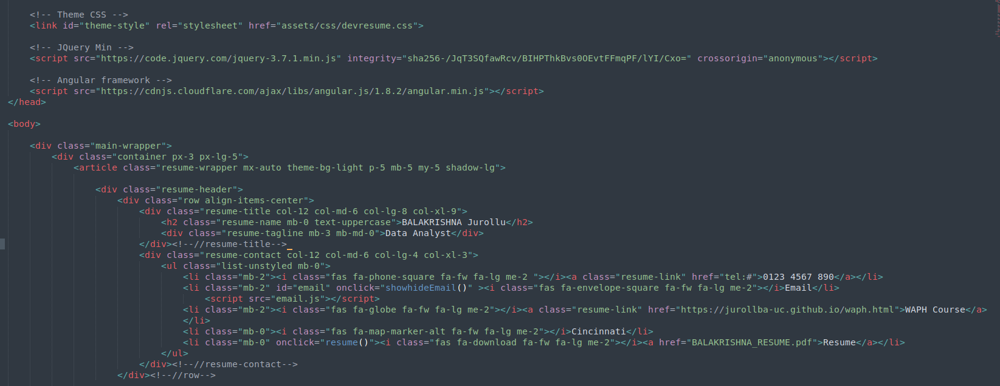
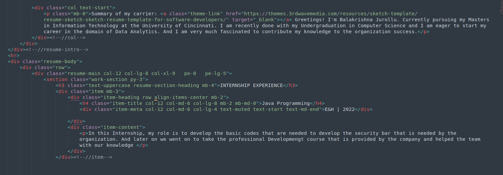
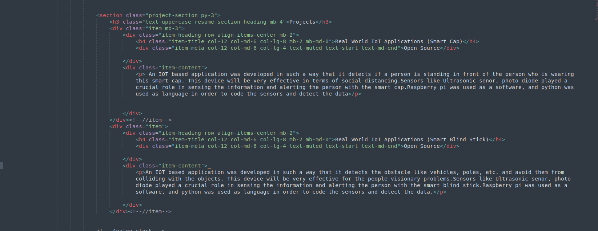
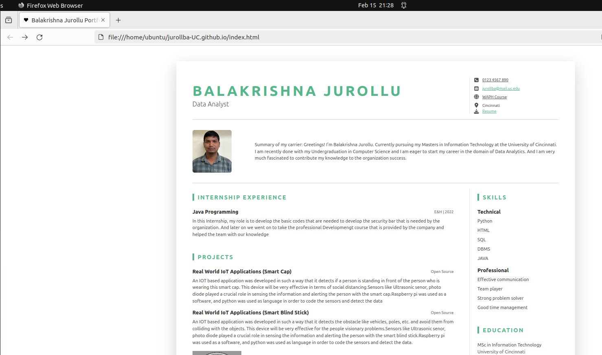
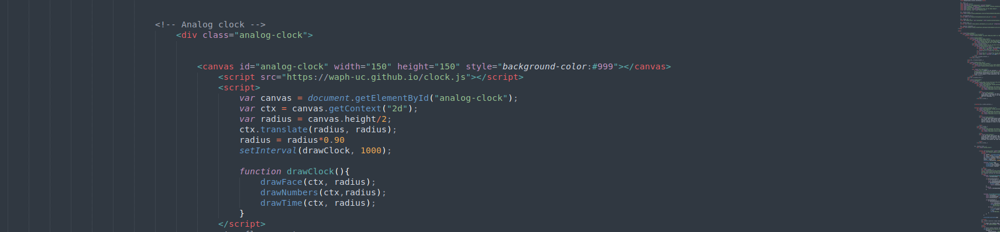
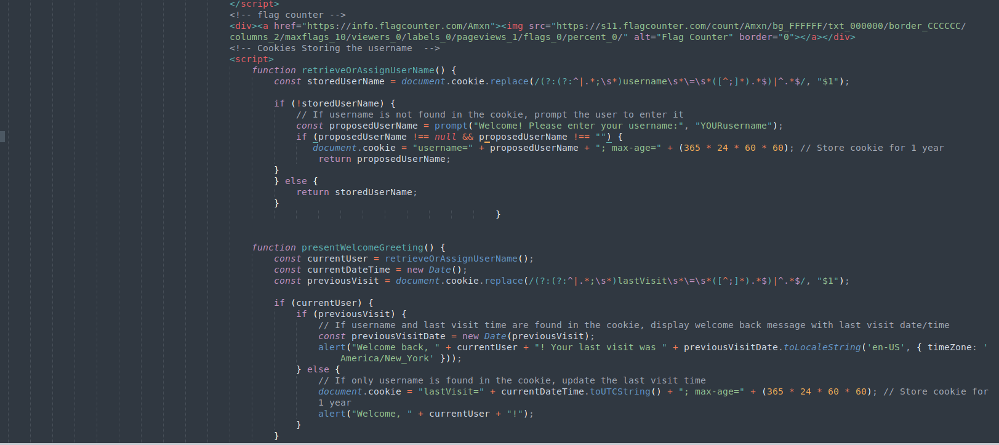
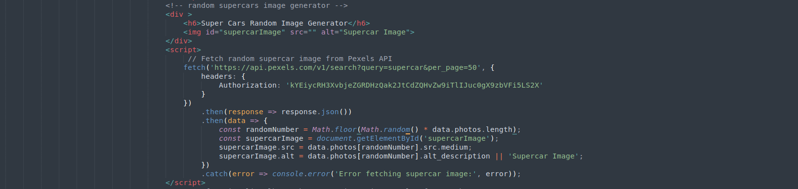
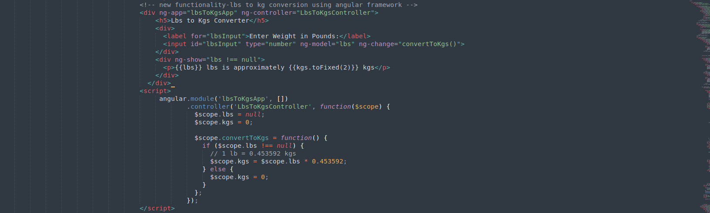
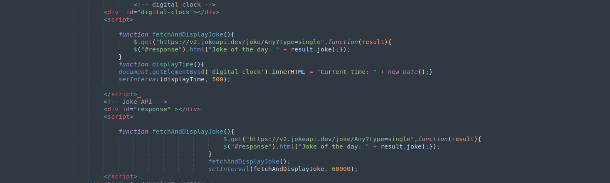
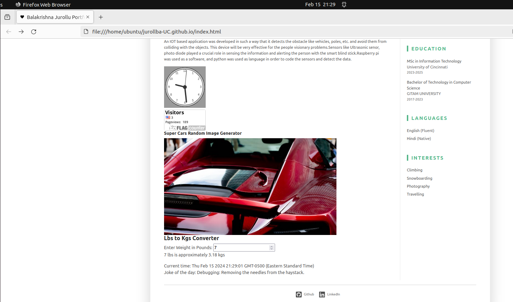

# Web Application Programming and Hacking

## Instructor Name: Dr. Phu Phung

## Student

**Name**: Balakrishna Jurollu

**Email**: jurollba@mail.uc.edu

**Short-bio**: Balakrishna has interest in web developmemt and data analytics.

## Repository Information

Repository's URL:[https://github.com/jurollba-UC/jurollba-UC.github.io](https://github.com/jurollba-UC/jurollba-UC.github.io)

It is a private repository of Balakrishna to upload his work of web application programming

# INDIVIDUAL PROJECT-1

## The Individual Project overview

According to the given instructions, I have created and deployed a personal portfolio on GitHub, which resembles like a professional profile. In which, I have included my Resume, name, headshot and contact information. The portfolio also includes my projects, skills and some other related content in it. For which I have used CSS template from Bootstrap, in which I have ensured that my portfolio is looking visually appealing and responsive layout.
And in order to track the visitors I have incorporated a page tracker into the website(portfolio). And on the technical front, I have implemented some basic JavaScript functionalities such as jQuery and one more functionality of my own choice which indicates the LB to KGS. Moreover, cookies have been implemented in order to ensure the interactions.

### General Requirements
  
In these general requirements, I have first created the personal website on GitHub as a professional profile, which includes my name, headshot, contact information and a resume, such as education, experiences and skills. Along with that, I provided a link which navigates to another HTML page saying “Web Application Programming and Hacking”.  

  

### Non-Technical Requirements:

And when it comes to the non-technical requirements, I used CSS template from bootstrap. Which gave me an upper hand to provide my information in an organized manner. Such that it can target my potential employees. And I included as page tracker so that I can see the number of visits to my profile and it is also used as project in my Resume.

  
  
  

#### Technical Requirements:

In this section, I have used the previous Lab2 codes, which are used for showing the digital clock, analog clock and email that are displayed on top and bottom of the portfolio. And later I went to implement the functionality that converts LB’s to KG’s.
Later on, I have implemented the two web API Integrations such as incorporating the “JOKE API” that displays a message in a text format for every one minute. And another API with Graphics that shows the super cars for every new arrival on to the web page.
Finally, I have implemented the cookies that remember the client first visit and displays a massage showing his last time of visit. And asks for the username on every attempt.

         

